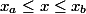
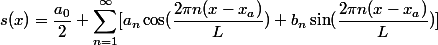
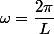
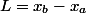

# Fast Fourier Series

## Abstract
The Fourier Series is frequently used in solutions to partial
 differential equations such as the heat equation and the wave
 equation.  One of the defining characteristics is that given
 an infinite number of wave frequencies, any function that
 is piecewise smooth can be replicated exactly.  Having said that,
 it is an excellent tool for approximating a discrete function in
 continuous space.  Furthermore, another useful application of the
 Fourier Series is in digital signal processing; specifically in the
 realm of eliminating noise from a signal.  Having said that, the
 periodic nature of Fourier Series results in some discrete functions
 to be very difficult to represent continuously with a finite number
 of wave frequencies.  The purpose of this study is to provide a
 methodology for which any discrete function to
 be accurately represented in continuous space while eliminating
 noise from the signal using the Fast Fourier Transform.

## Overview
#### Fourier Series Fundamentals
For a function, f(x) defined on the region

f(x) can be represented by the Fourier Series, s(x), as follows:

Where

#### Fourier Series from the Discrete Fourier Transformation
#### Fourier Series Padding
#### Eliminating Noise Using Fourier Analysis

## Fourier Series Fundamentals

## Fourier Series from the Discrete Fourier Transformation

## Fourier Series Padding

## Eliminating Noise Using Fourier Analysis
