# Fast Fourier Series

## Abstract
The Fourier Series is frequently used in solutions to partial
 differential equations such as the heat equation and the wave
 equation.  One of the defining characteristics is that given
 an infinite number of wave frequencies, any function that
 is piecewise smooth can be replicated exactly.  Having said that,
 it is an excellent tool for approximating a discrete function in
 continuous space.  Furthermore, another useful application of the
 Fourier Series is in digital signal processing; specifically in the
 realm of eliminating noise from a signal.  Having said that, the
 periodic nature of Fourier Series results in some discrete functions
 to be very difficult to represent continuously with a finite number
 of wave frequencies.  The purpose of this study is to provide a
 methodology for which any discrete function to
 be accurately represented in continuous space while eliminating
 noise from the signal using the Fast Fourier Transform.

## Fourier Series from the Discrete Fourier Transform
The manner in which a Fourier Series is obtained using the Discrete Fourier Transform is discussed
 [here](https://github.com/jbhersch/fast_fourier_series/blob/master/fast_fourier_series.pdf).

## Fourier Series Approximation of the Bell Curve
To begin with, the bell curve, f(x) = exp(-x**2), will be examined on the range
-2 <= x <= 2.  The true function and the Fourier Series approximation are shown
in the plot below.

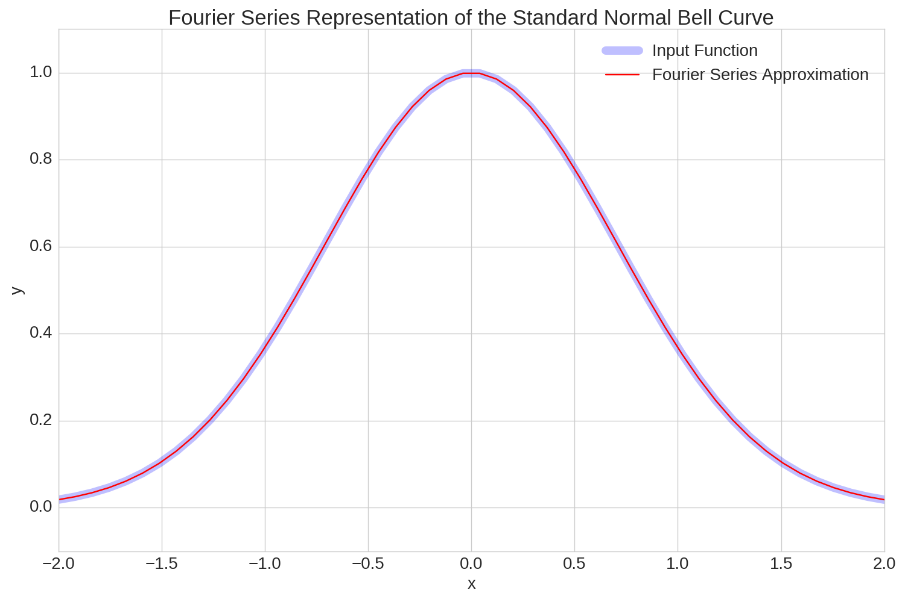

As shown, the Fourier Series does an excellent job approximating this function.
When the Fourier Series is evaluated on the range -2 <= x <= 6, the periodic
nature of the Fourier Series is revealed as shown in the following chart.

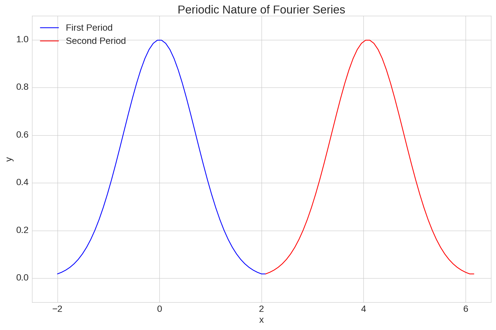

As mentioned, the Fourier Series allows for discrete data to be represented
continuously.  One of the benefits of this is that the derivatives can be easily
approximated as well.  The first and second derivatives of the bell curve and
their corresponding Fourier Series approximations are shown below.

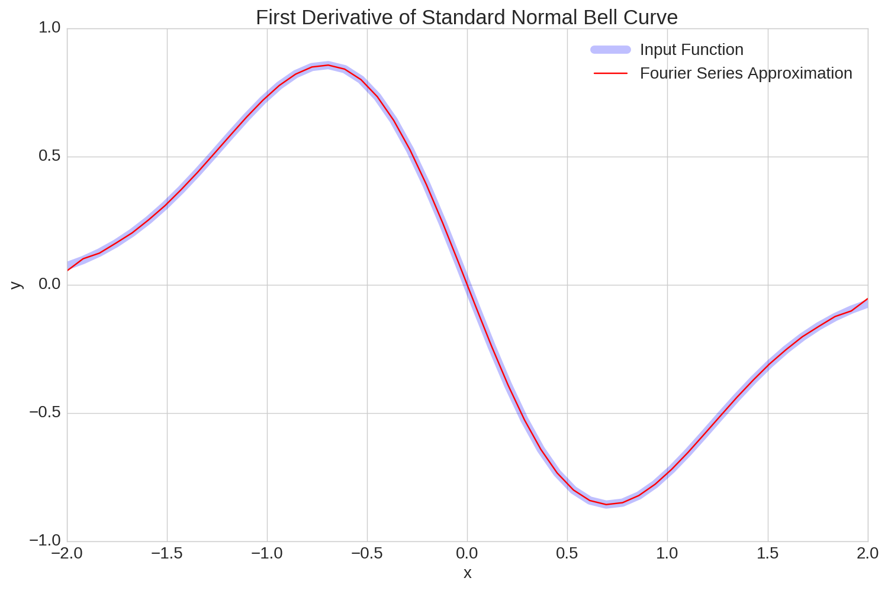
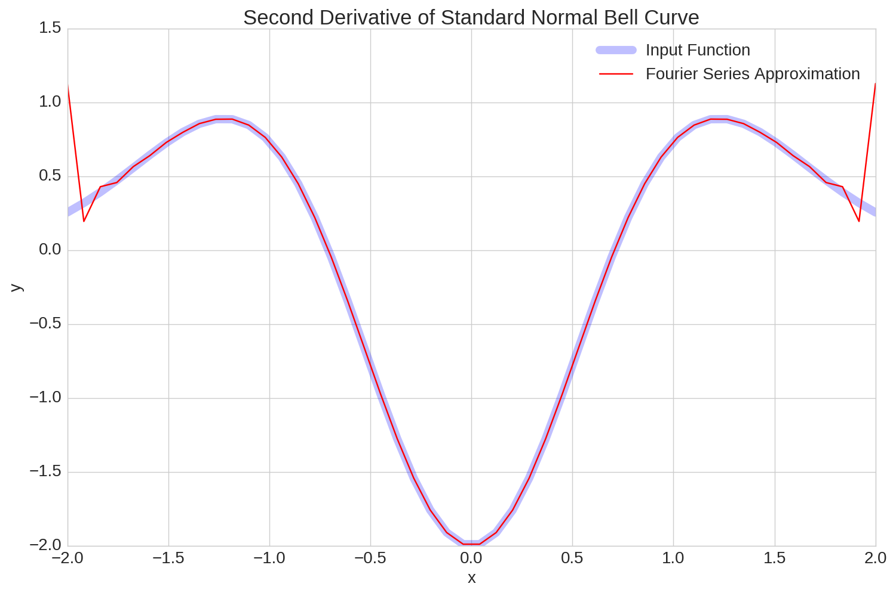

The derivative approximations are clearly not as accurate as the approximations
of the original function, but with the exception of the boundaries of the second
derivative, the approximations are still fairly accurate.  The fact that the
Fourier Series approximations are so accurate is largely due to the fact that
the bell curve is symmetric about x = 0 over the range -2 <= x <= 2 and as a
result, f(-2) = f(2).  Next, it will be shown that if the difference between
f(-2) and f(2) is significant then the Fourier Series has a difficult time
approximating the input function accurately.

## Fourier Series Approximation of the Cubic Function
The function f(x) = x**3 over the range -2 <= x <= 2 will now be examined.  The
true function along with the Fourier Series approximation are shown in the plot
below.

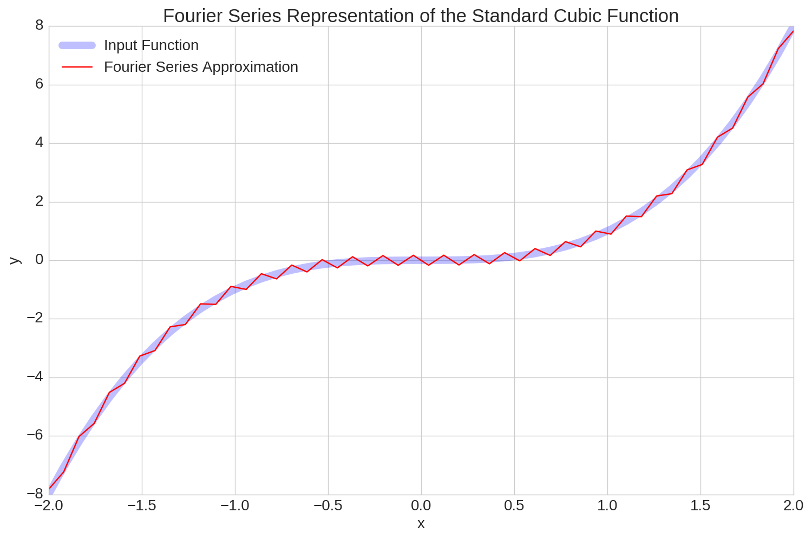

For the most part, the Fourier Series approximation emulates the true function,
but there is clearly some noise and it is not nearly as accurate as the bell
curve approximation.  The next plot, which shows two periods of the cubic function
over the range -2 <= x <= 6 helps demonstrate why the Fourier Series approximation
to the cubic function is so much less accurate than the bell curve.

Notice how abruptly the function is forced down from y being 8 at the
end of the first period and -8 at the beginning of the second period.  
This jagged transition is the source of the noise in the Fourier Series approximation.

Approximations of the first two derivatives deviate even further from the true
values, which is shown in the following two plots.

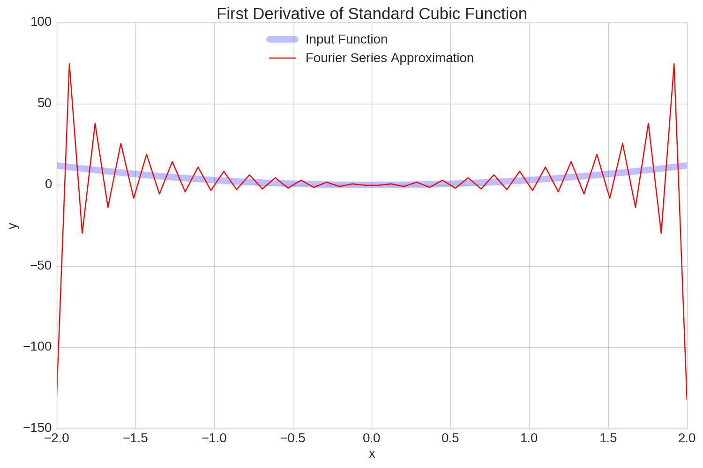
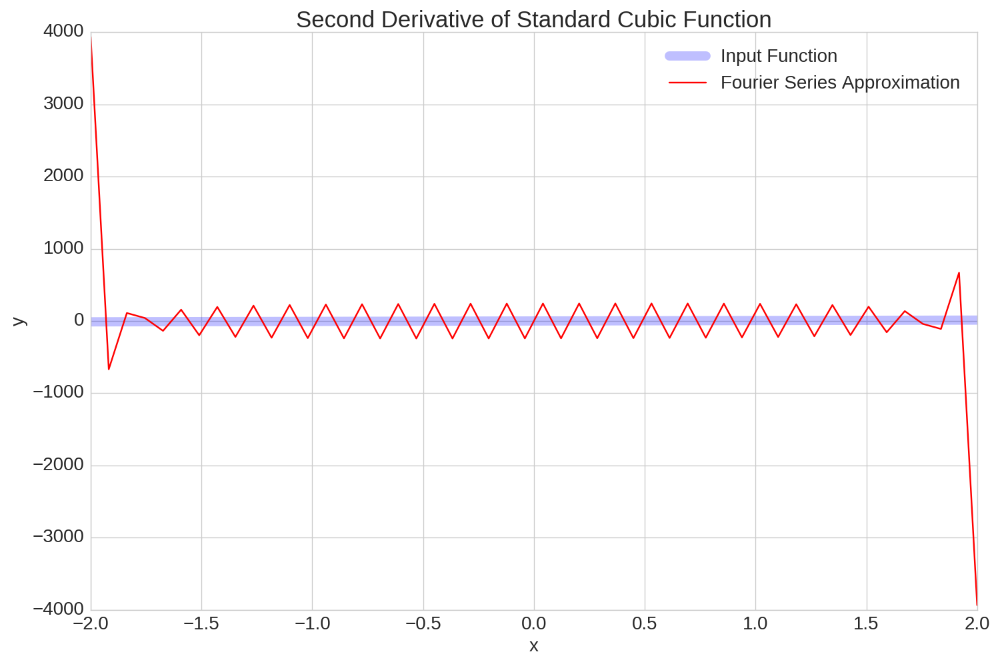

The first derivative approximation isn't terrible in the center, but it gets further
and further from the true first derivative as x approaches -2 and 2.  The second
derivative is even worse, with an error of roughly 4,000 at the edges of the plot.  
If only there was a way to smoothen the transition between periods and perhaps
reduce these errors...

## Padding
Introducing artificial data points at the end of the input function, or padding,
allows for the transition between periods to be smoothened.  The input parameter
for padding is the number of padded points to insert, p.  The y values of the
padded region are obtained by a cubic interpolation derived from four data points.  
The mathematics of defining the interpolation polynomial is more formally explained
[here](https://github.com/jbhersch/fast_fourier_series/blob/master/polynomial_interpolation.pdf).

The plot below shows the padded values added to the same cubic function discussed
previously.

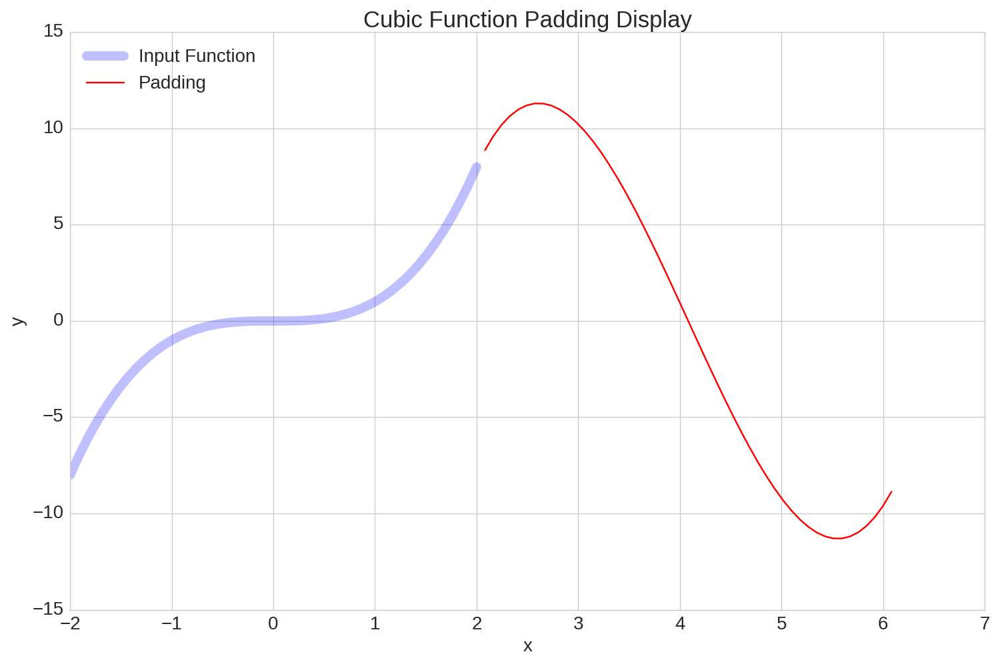

In the next plot, the blue curve shows the original input function, and the red curve shows the
padding that is introduced.  Clearly, the padding creates a much smoother transition
between periods than the original cubic function.

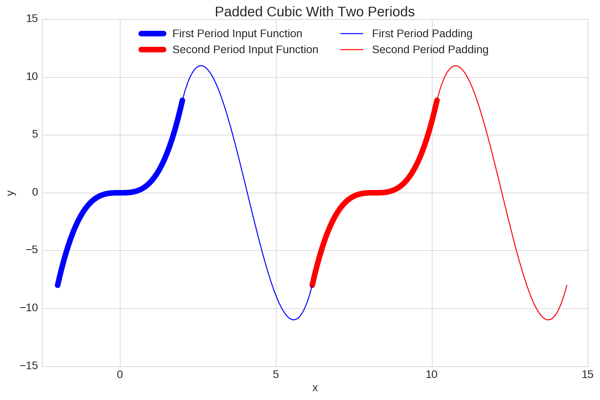

The benefit of using a cubic interpolation polynomial is that both the first and
second derivatives match that of the original cubic function at the beginning and
end of the padding.

As expected, the addition of padding provides a much better Fourier Series
approximation to the cubic function than without, with is illustrated in the
next plot.

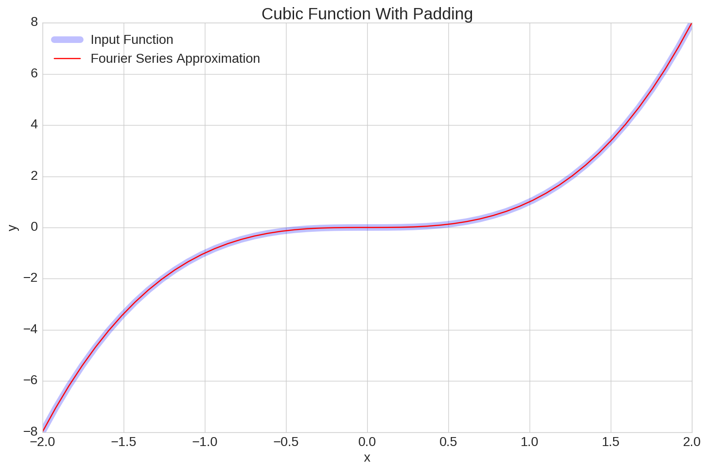

Similarly, padding the input function also drastically increases the accuracy of
the first two derivative approximations.

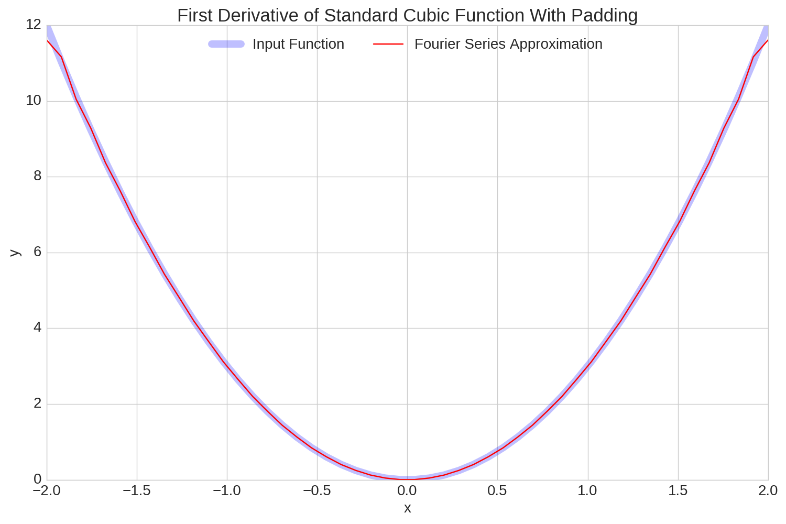
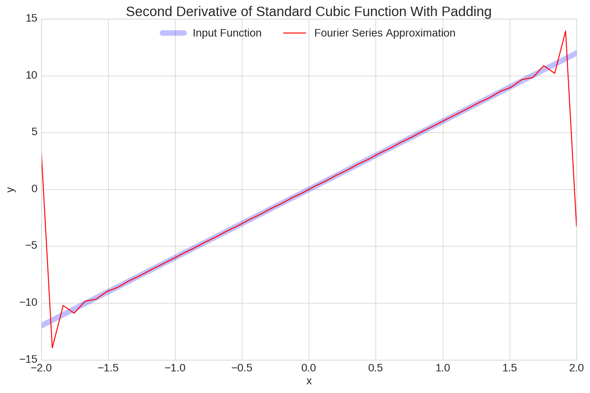

Similar to the bell curve, the derivative approximations deviate at the edges of
the plots, but for the most part they are very accurate.

## Noise Removal
