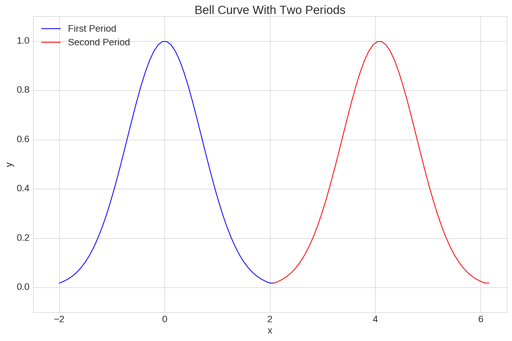
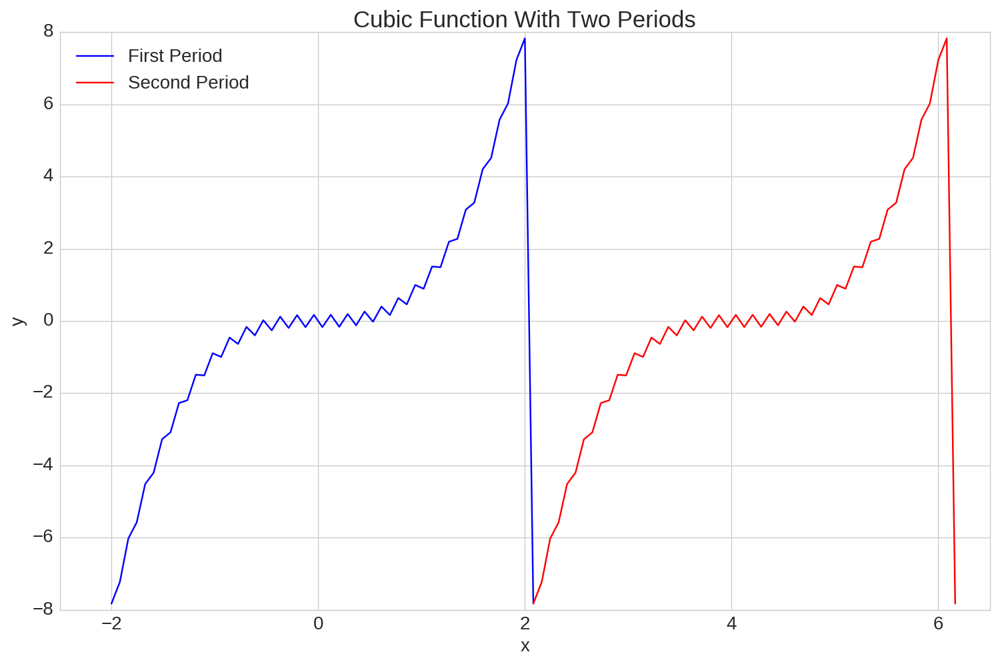
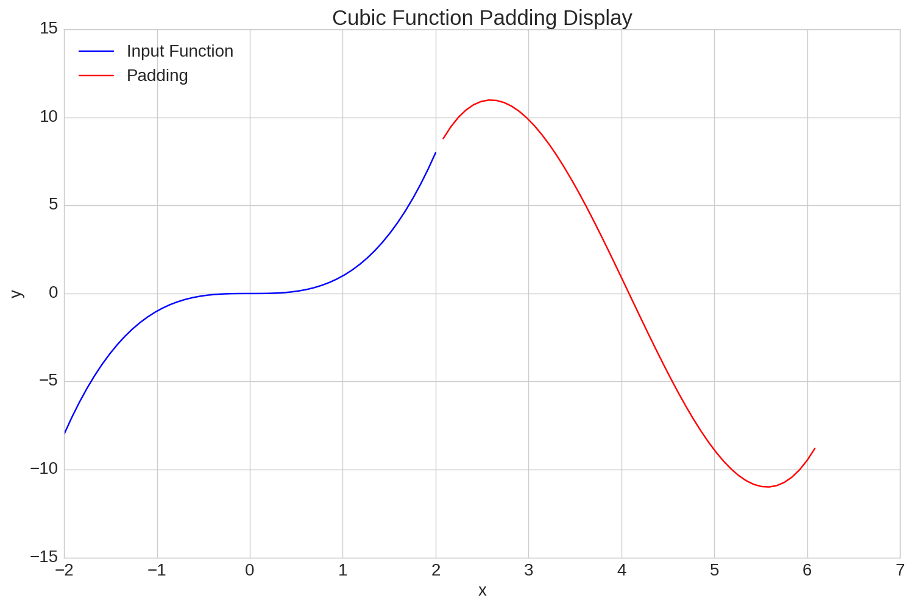

# Fast Fourier Series

## Abstract
The Fourier Series is frequently used in solutions to partial
 differential equations such as the heat equation and the wave
 equation.  One of the defining characteristics is that given
 an infinite number of wave frequencies, any function that
 is piecewise smooth can be replicated exactly.  Having said that,
 it is an excellent tool for approximating a discrete function in
 continuous space.  Furthermore, another useful application of the
 Fourier Series is in digital signal processing; specifically in the
 realm of eliminating noise from a signal.  Having said that, the
 periodic nature of Fourier Series results in some discrete functions
 to be very difficult to represent continuously with a finite number
 of wave frequencies.  The purpose of this study is to provide a
 methodology for which any discrete function to
 be accurately represented in continuous space while eliminating
 noise from the signal using the Fast Fourier Transform.

## Overview
#### Fourier Series Fundamentals
Consider a piecewise smooth function, f(x), defined on the region

f(x) can be represented by the Fourier Series, s(x), as follows:

Where

The coefficients a0, an, and bn are determined differently depending on whether
or not f(x) is continuous or discrete.  In this case, discrete data is examined
and the Fourier Series coefficients are obtained using the Discrete Fourier Transform.

#### Fourier Series from the Discrete Fourier Transform
Before the manner in which a Fourier Series is generated from the Discrete
Fourier Transform is described, the necessary input variables must be discussed.  Two vectors,
x and y, of length, N, where y is a function of x, are required to generate the Fourier Series.  The vector, x,
must be defined such that x[n] < x[n+1] for 0 <= n < N and all elements of x are
uniformly spaced from one another.  If xa = x[0] and xb = x[N-1],
then the span of x, L, is given by xb - xa as in the equation above.  The only restriction
on y is that its elements are real numbers.  The Fourier Coefficients a0, an, and bn
shown in the expression for s(x) above will be obtained by applying the Discrete
Fourier Transform to y.  It should be noted that the Fourier Series generated from
the Discrete Fourier Transform is an approximation, unlike the expression for s(x),
so the summation will go from 1 to N/2 rather than 1 to infinity.

The Discrete Fourier Transform used here is the Fast Fourier Transform from the
[scipy fftpack](https://docs.scipy.org/doc/scipy/reference/fftpack.html).  The fft function applied to y will
yield a complex vector, yt, of length N.  yt is then used to obtain the N/2 Fourier Series
coefficients.  The first element of yt, yt[0], is used to obtain the zero frequency
Fourier Series Coefficient, a0, which is equal to 2*yt[0]/N.  The first and second
halves of the remaining elements of yt are complex conjugates of one another.  In
other words yt[1:N/2+1] and yt[N/2+1:] are complex conjugates.  As such, the remaining
Fourier Series Coefficients are obtained from yt[1:N/2+1]. Letting c = 2*yt[:N/2+1]/N,
the nth element of c, cn, is then equal to an - bn * i.  Inserting a0, an, and bn
into the expression for s(x) shown above will then yield the Fourier Series approximation
for any x* value such that xa <= x* <= xb.

#### Fourier Series Padding
Since Fourier Series are summations of sine and cosine waves of varying harmonic
frequencies, they are inherently periodic.  Therefore, when the series is evaluated
at the end of a period, the final value is forced to the initial value of the
input function and in some cases this occurs very abruptly.  When this does occur
abruptly it is difficult for the Fourier Series on its own to accurately approximate
the input function, which is where padding comes in.  In essence, padding the input
function with artificially generated values that allow the the first and last points
of the period to more smoothly transition into one another can greatly increase the
accuracy of the Fourier Series Approximation.  

#### Eliminating Noise Using Fourier Analysis

## Fourier Series Fundamentals

## Fourier Series from the Discrete Fourier Transform

## Fourier Series Padding

## Eliminating Noise Using Fourier Analysis

## Bell Curve
To begin with, the bell curve, f(x) = exp(-x**2), will be examined on the range
-2 <= x <= 2.  The true function and the Fourier Series approximation are shown
in the plot below.

As shown, the Fourier Series does an excellent job approximating this function.
When the Fourier Series is evaluated on the range -2 <= x <= 6, the periodic
nature of the Fourier Series is revealed as shown in the following chart.

As mentioned, the Fourier Series allows for discrete data to be represented
continuously.  One of the benefits of this is that the derivatives can be easily
approximated as well.  The first and second derivatives of the bell curve and
their corresponding Fourier Series approximations are shown below.

The derivative approximations are clearly not as accurate as the approximations
of the original function, but with the exception of the boundaries of the second
derivative, the approximations are still fairly accurate.  The fact that the
Fourier Series approximations are so accurate is largely due to the fact that
the bell curve is symmetric about x = 0 over the range -2 <= x <= 2 and as a
result, f(-2) = f(2).  Next, it will be shown that if the difference between
f(-2) and f(2) is significant then the Fourier Series has a difficult time
approximating the input function accurately.

## Cubic
The function f(x) = x**3 over the range -2 <= x <= 2 will now be examined.  The
true function along with the Fourier Series approximation are shown in the plot
below.

For the most part, the Fourier Series approximation emulates the true function,
but there is clearly some noise and it is not nearly as accurate as the bell
curve approximation.  The next plot, which shows two periods of the cubic function
over the range -2 <= x <= 6 helps demonstrate why the Fourier Series approximation
to the cubic function is so much less accurate than the bell curve.

Notice how abruptly the function is forced down from y being 8 at the
end of the first period and -8 at the beginning of the second period.  
This jagged transition is the source of the noise in the Fourier Series approximation.

Approximations of the first two derivatives deviate even further from the true
values, which is shown in the following two plots.

The first derivative approximation isn't terrible in the center, but it gets further
and further from the true first derivative as x approaches -2 and 2.  The second
derivative is even worse, with an error of roughly 4,000 at the edges of the plot.  
If only there was a way to smoothen the transition between periods and perhaps
reduce these errors...

## Padding
Introducing artificial data points at the end of the input function, or padding,
allows for the transition between periods to be smoothened.  The input parameter
for padding is the number of padded points to insert, p.  The y values of the
padded region are obtained by a cubic interpolation derived from four data points.  
The x values of these four data points are [ x[-2], x[-1], xb + p*h, xb + (p+1)*h ]
where h is the uniform spacing increment of the x values.  The y values of these
four data points are [ y[-2], y[-1], y[0], y[1] ].  The mathematics of defining
the interpolation polynomial is more formally explained in XXX.

The plot below shows the padded values added to the same cubic function discussed
previously.

The blue curve shows the original input function, and the red curve shows the
padding that is introduced.  Clearly, the padding creates a much smoother transition
between periods than the original cubic function, which is further demonstrated
in the following plot of two periods with padding.

The benefit of using a cubic interpolation polynomial is that both the first and
second derivatives match that of the original cubic function at the beginning and
end of the padding.

## Noise Removal
